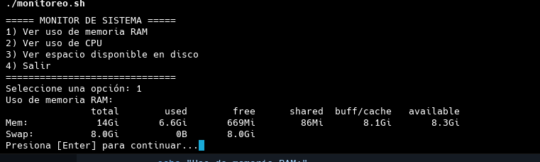
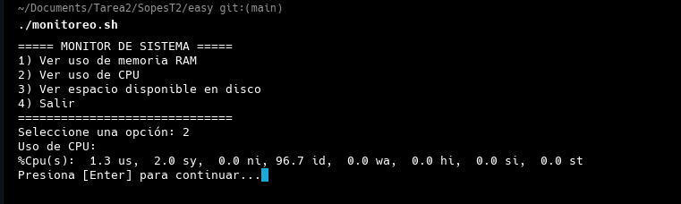
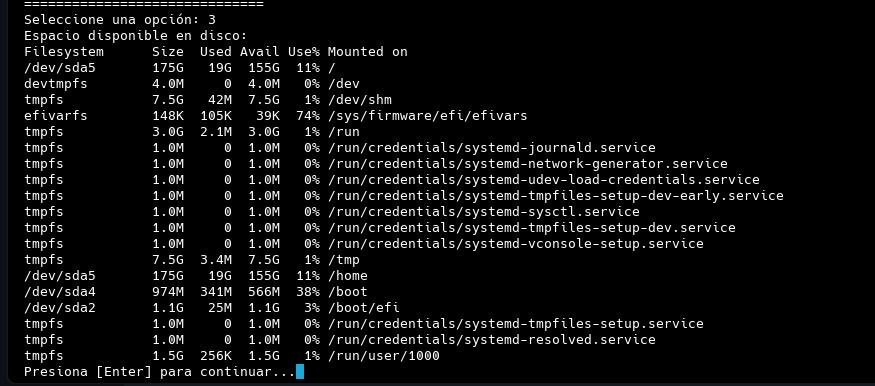
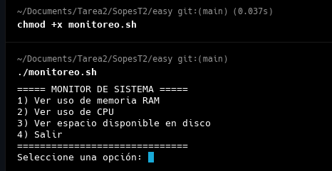

# Monitor de Sistema en Bash

Este script en **Bash** permite monitorear el estado del sistema en tiempo real, mostrando información sobre el **uso de memoria RAM**, **uso de CPU** y **espacio en disco**. Proporciona un menú interactivo que permite seleccionar la opción deseada y ver los resultados en pantalla.

## 📜 **Funcionamiento del Script**

El script funciona dentro de un bucle `while true`, lo que significa que se ejecutará continuamente hasta que el usuario seleccione la opción de salir (`4`).

Cada opción en el menú ejecuta un comando específico del sistema para obtener información relevante:

- **`free -h`** → Muestra el uso de memoria RAM en un formato legible.
- **`top -bn1 | grep "Cpu(s)"`** → Extrae la línea con información sobre el uso de CPU.
- **`df -h`** → Muestra el espacio en disco disponible de forma clara.
- **`exit 0`** → Finaliza el script si el usuario elige la opción de salida.

## 📄 **Código del Script**

```bash
#!/bin/bash

while true; do
    clear
    echo "===== MONITOR DE SISTEMA ====="
    echo "1) Ver uso de memoria RAM"
    echo "2) Ver uso de CPU"
    echo "3) Ver espacio disponible en disco"
    echo "4) Salir"
    echo "=============================="
    read -p "Seleccione una opción: " opcion

    case $opcion in
        1)
            echo "Uso de memoria RAM:"
            free -h
            ;;
        2)
            echo "Uso de CPU:"
            top -bn1 | grep "Cpu(s)"
            ;;
        3)
            echo "Espacio disponible en disco:"
            df -h
            ;;
        4)
            echo "Saliendo..."
            exit 0
            ;;
        *)
            echo "❌ Opción inválida, intenta de nuevo."
            ;;
    esac
    read -p "Presiona [Enter] para continuar..."
done
```

---

## 🛠 **Explicación de los Comandos Utilizados**

### **1️⃣ `free -h` (Memoria RAM)**
Este comando muestra información sobre el uso de la **memoria RAM** y la memoria de intercambio (**swap**) en el sistema.

- `-h` → Muestra la información en un formato **legible** (GB, MB, KB) en lugar de solo bytes.

🔹 **Ejemplo de salida:**
  

---

### **2️⃣ `top -bn1 | grep "Cpu(s)"` (Uso de CPU)**

- `top` → Es una herramienta que muestra el **uso en tiempo real de la CPU y procesos activos**.
- `-b` → Modo **batch**, ejecuta `top` sin abrir la interfaz interactiva.
- `-n1` → Muestra **solo una actualización** y luego termina.
- `grep "Cpu(s)"` → Filtra la línea con el **uso de CPU**.

🔹 **Ejemplo de salida:**
  
📌 **Explicación de los valores:**
- **us** → Uso de CPU por procesos de usuario.
- **sy** → Uso de CPU por procesos del sistema (kernel).
- **id** → CPU inactiva.
- **wa** → CPU esperando operaciones de disco.

---

### **3️⃣ `df -h` (Espacio disponible en disco)**

Muestra el **espacio usado y disponible** en cada partición del sistema de archivos.

- `-h` → Muestra los valores en un formato **legible** (GB, MB, KB).

🔹 **Ejemplo de salida:**
  
📌 **Columnas importantes:**
- **Size** → Tamaño total de la partición.
- **Used** → Espacio usado.
- **Avail** → Espacio disponible.
- **Use%** → Porcentaje de uso del disco.
- **Mounted on** → Punto de montaje (dónde está ubicado el sistema de archivos).

---

## 🏁 **Cómo ejecutar el script**

1️⃣ **Guarda el archivo** como `monitoreo.sh`

2️⃣ **Otorga permisos de ejecución:**
```bash
chmod +x monitoreo.sh
```

3️⃣ **Ejecuta el script:**
```bash
./monitoreo.sh
```

---

## ✨ **Posibles Mejoras**
✅ Guardar los registros en un archivo `monitoreo.log`.
✅ Monitoreo en tiempo real con `watch`.
✅ Notificaciones si la RAM o CPU superan un umbral.
✅ Mostrar solo el espacio libre del disco (`df -h --output=avail /`).

📌 **¿Quieres que agreguemos más funcionalidades? ¡Abierto a mejoras! 🚀**

